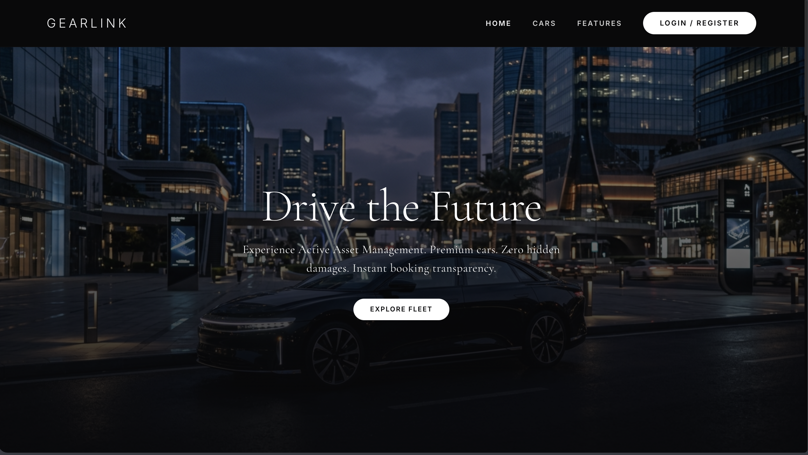
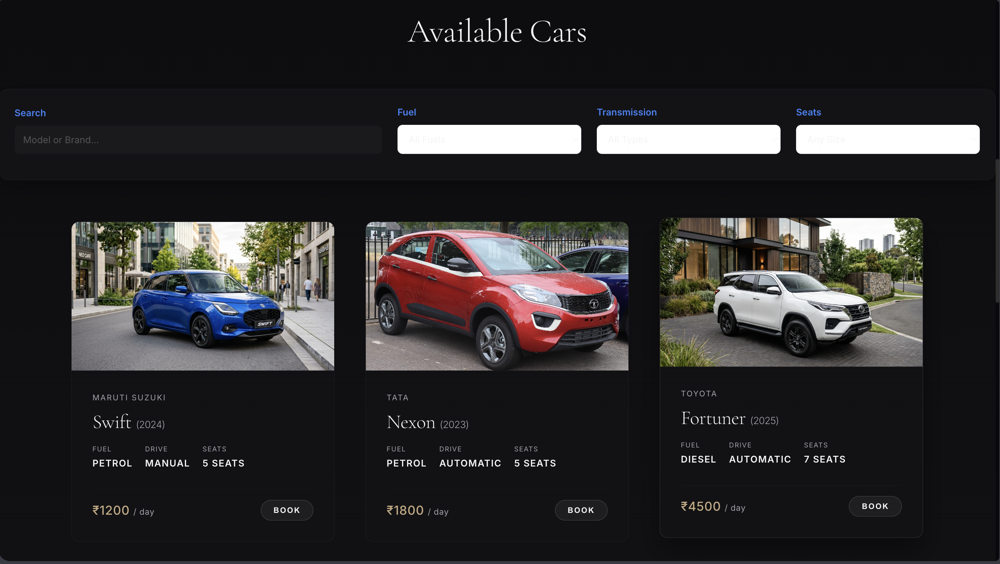
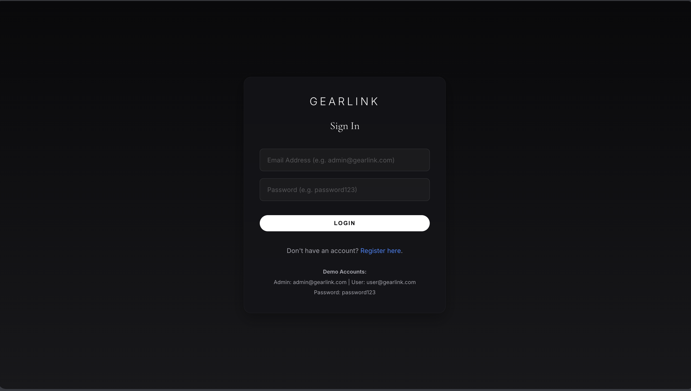
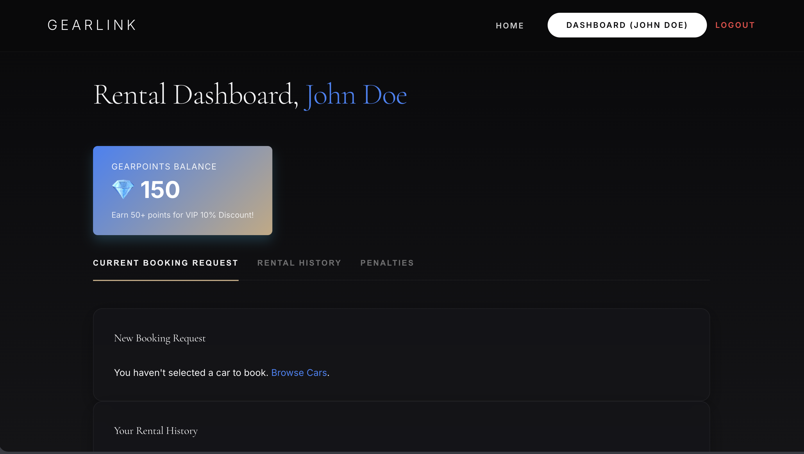
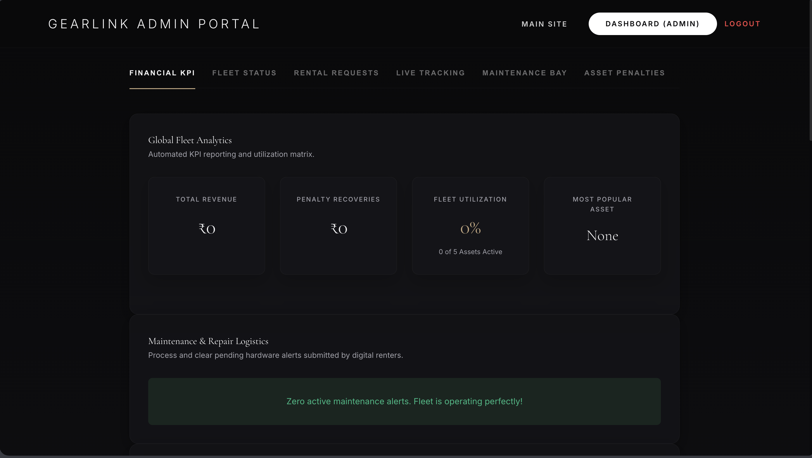
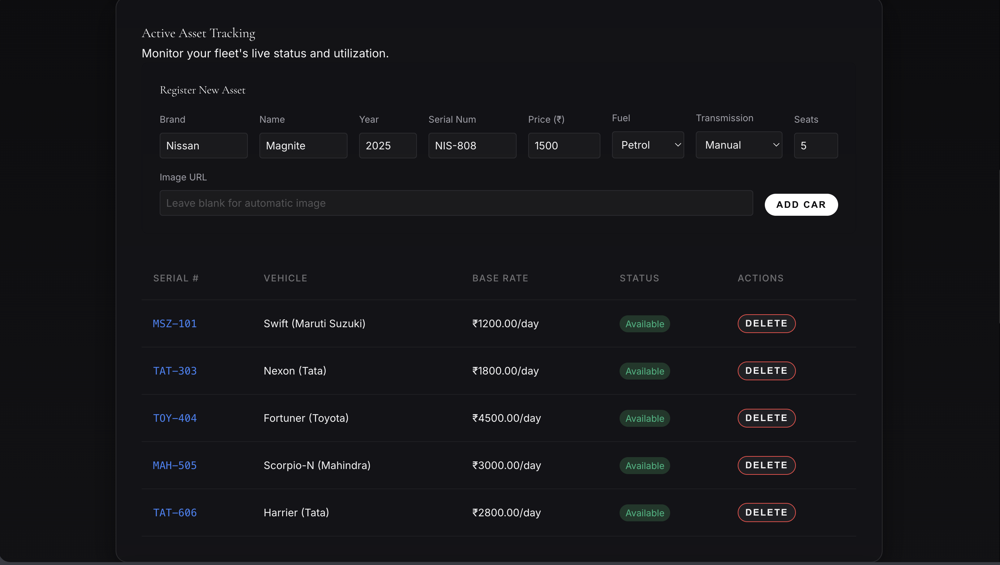
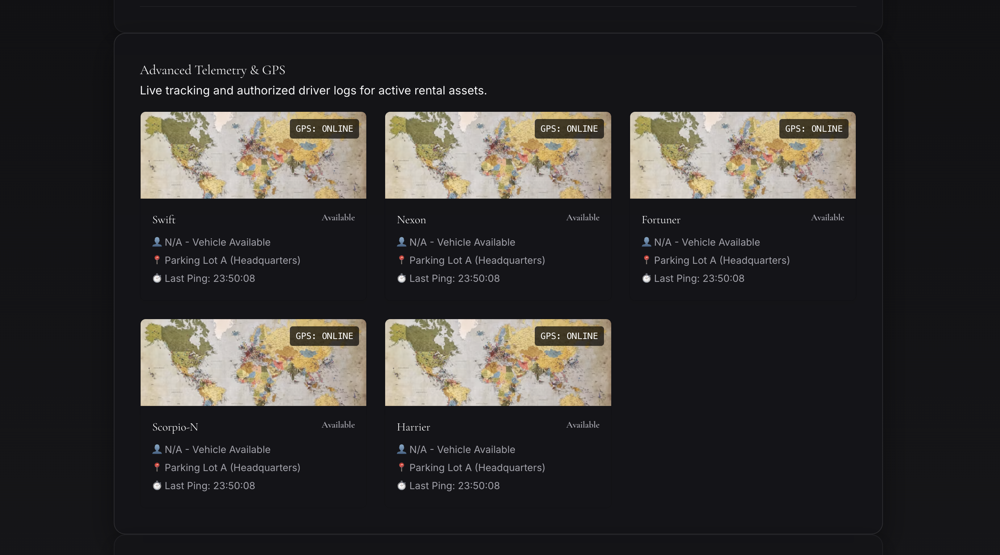
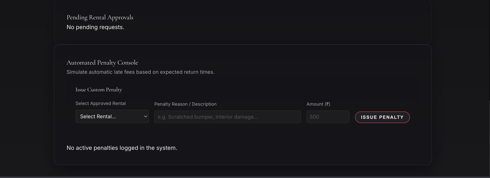
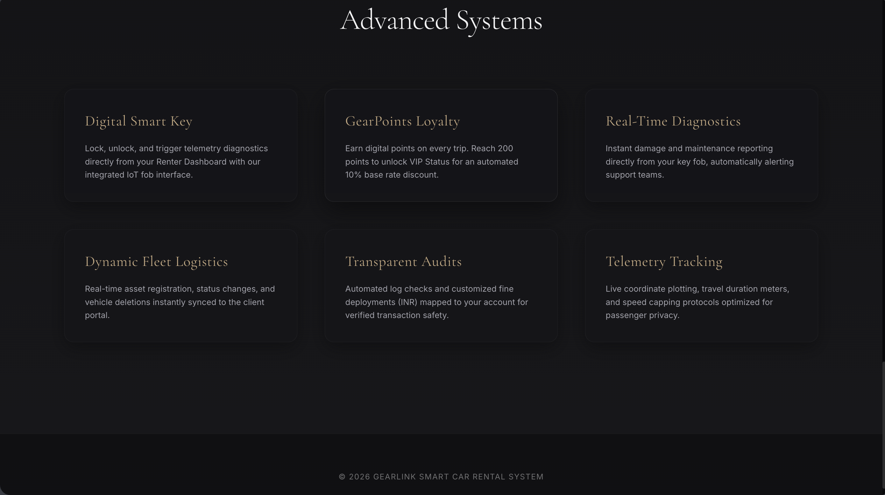

# GearLink Car Rental System ⚙️

<p align="center">
  <strong>A modern, Tesla-inspired car rental platform with dedicated User & Admin dashboards.</strong>
</p>

<p align="center">
  <a href="https://gearlink18.netlify.app/" target="_blank">
    
  </a>
</p>

---

## 📖 About the Project

GearLink is a responsive car rental web application that simplifies the vehicle rental experience through an intuitive interface for customers and administrators. Users can browse available cars, book rentals, track their rental status, and manage their accounts, while administrators can oversee bookings, penalties, and rental operations through a dedicated dashboard.

The interface follows a clean, minimal design inspired by modern automotive brands, delivering a smooth experience across desktop and mobile devices.

---

# Features❗️

- 🚗 Browse available rental cars
- 🔍 Search and explore vehicle catalog
- 📅 Book vehicles online
- 👤 Secure User Login
- 🛠️ Admin Login & Dashboard
- 📊 User Dashboard
- 📌 Rental Status Tracking
- 💰 Penalty Management
- 📱 Fully Responsive Layout
- 🎨 Tesla-inspired Minimal UI
- ⚡ Fast & Lightweight
- 💻 Cross-Device Compatibility

---

# 🛠️ Tech Stack

| Frontend | Styling | Deployment | Version Control |
|-----------|----------|------------|-----------------|
| HTML5 | CSS3 | Netlify | Git |
| JavaScript (ES6) | Flexbox & Grid | | GitHub |

---

# 🌐 Live Demo

👉 **https://gearlink18.netlify.app/**

---

# 📸 Project Preview

## Home Page



---

## Available Cars



---

## Sign In



---

## User Dashboard



---

## Admin Portal



---

## Rental Tracking



---

## GPS Tracking



---

## Pending Approvals



---

## Advertisement System



---

# 📂 Project Structure

```
GearLink-Car-Rental-System
│
├── css/
├── images/
├── js/
├── screenshots/
├── index.html
├── login.html
├── dashboard-user.html
├── dashboard-admin.html
└── README.md
```

---

# 🚀 Run Locally

Clone the repository

```bash
git clone https://github.com/Krishna-Ghodake/gearlink-car-rental-system.git
```

Open the project folder

```bash
cd gearlink-car-rental-system
```

Launch the application

Open `index.html` in your browser.

---

# 🎯 Future Improvements

- Backend Integration
- Database Support
- Online Payment Gateway
- Email Notifications
- Booking History
- Car Availability Calendar
- Profile Management
- Real-time Booking Updates

---

# 📄 License

This project is licensed under the **MIT License**.

---

# 👨‍💻 Developer

**Krishna Ghodake**

- GitHub: https://github.com/Krishna-Ghodake
- LinkedIn: https://www.linkedin.com/in/krishna-ghodake-550406318/

---

<p align="center">
⭐ If you found this project useful, consider giving it a star!
</p>
